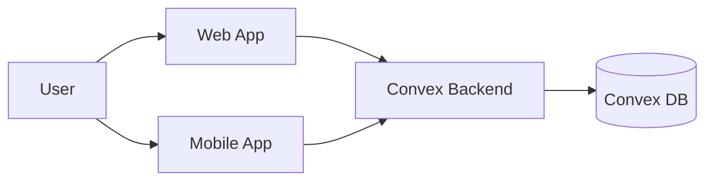

# Architecture

> Status: draft. Living document — update with each significant change.

## 1. Overview

DomusOS is a cross-platform application with a shared real-time backend. Web and mobile clients connect to a Convex backend for data sync, queries, and mutations.

## 2. Context

## 3. Components

| Component  | Path               | Responsibility                                |
| ---------- | ------------------ | --------------------------------------------- |
| Web App    | `apps/web`         | Next.js 16 App Router — browser UI            |
| Mobile App | `apps/mobile`      | Expo 56 with expo-router — iOS/Android UI     |
| Backend    | `packages/backend` | Convex functions — schema, queries, mutations |

Both apps import from `@domus/backend` for shared types and Convex API references.

## 4. Data flow

Both clients use Convex's React hooks (`useQuery`, `useMutation`) which maintain a real-time subscription to the backend. Data flows:

1. Client calls `useQuery(api.tasks.list)` → Convex runs the query function → returns results + subscribes to changes.
2. Client calls `useMutation(api.tasks.create)` → Convex runs the mutation → all subscribed queries automatically re-evaluate.

## 5. Tech stack

| Layer      | Technology                 | Version     |
| ---------- | -------------------------- | ----------- |
| Language   | TypeScript (strict)        | 6.0         |
| Web        | Next.js (App Router)       | 16.x        |
| Mobile     | Expo + expo-router         | 56.x        |
| Backend/DB | Convex                     | 1.42        |
| Monorepo   | Turborepo + pnpm           | 2.10 / 9.15 |
| Testing    | Vitest + Testing Library   | 4.x         |
| Lint       | ESLint + typescript-eslint | 9.x / 8.x   |
| Format     | Prettier                   | 3.8         |
| Git hooks  | Husky + lint-staged        | 9.x / 17.x  |

## 6. Cross-cutting concerns

TBD — auth, config, logging, error handling, security, observability.

## 7. Decisions

Significant choices are recorded as [ADRs](../adr/README.md).
